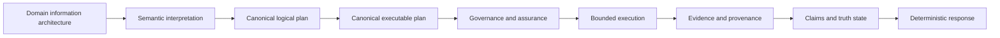

# IA-RAG public core

IA-RAG is a small, neutral runtime for information-architecture-aware
question answering. It makes the information architecture explicit before
execution: a domain describes entities and relations, semantic interpretation
produces a typed plan, governance admits or rejects that plan, bounded
execution produces evidence, and deterministic rendering exposes the result.

This repository is a local public-core candidate. It contains only a
hermetic reference runtime and synthetic domains. It does not include
external databases, model providers, enterprise identity integrations, or
application-specific adapters.

## Install

```bash
python -m pip install -e .
```

For development and tests:

```bash
python -m pip install -e '.[dev]'
pytest -q
```

## Quick start

```bash
python examples/reference_demo.py
```

The demo loads the synthetic research-network domain, registers its canonical
planner, compiles a question, admits and executes the exact executable plan,
and prints evidence, receipt lineage, and the deterministic response.

## Runtime model



The runtime has one selected planner, one logical-plan lineage, one
executable plan, and one receipt bound to the executed plan. Reference
assurance is injected explicitly and is deterministic. It can allow or deny
execution without compiling or replacing plans.

## Synthetic domains

The reference package includes `research_network` and `equipment_network`.
They are intentionally small and contain no application or customer data.
Both open-world and closed-world truth behavior are demonstrated by the
public tests.

## Scope and limitations

The public core is deliberately hermetic. Retrieval backends, language-model
providers, graph databases, vector indexes, lexical indexes, and deployment
integrations are extension points for future packages rather than base
dependencies. The reference runtime uses an in-memory graph store and exact
entity matching so that planning, governance, evidence, truth, and rendering
can be inspected without network access.

The current package is a private staging candidate. Licensing and publication
decisions are intentionally pending.

